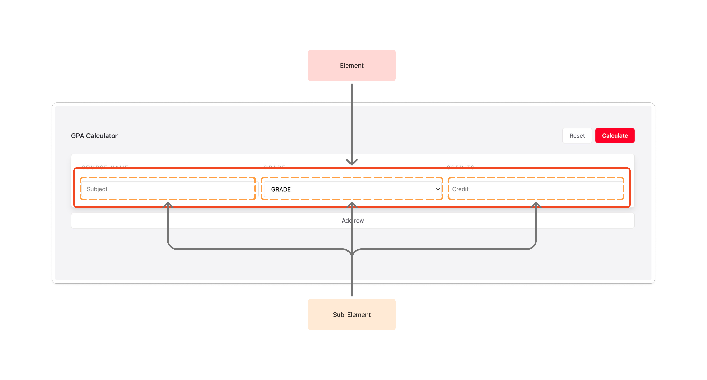

# SIT-Camp 2026 — Mini Project

> MiniProject ของเราเนี่ย มันจะเกี่ยวกับ เว็ปไซต์คํานวนเกรดเฉลี่ย หรือ GPA Calculator

ไฟล์ที่น้องจะต้อง Coding มี 2 ไฟล์ด้วยกัน

- `index.html` — Frontend side
- `index.js` — Backend side

---

## File: index.html

พี่จะให้ไฟล์นี้กับน้องๆ เป็นไฟล์ไว้เเสดง ui ของเว็ปไซต์ น้องไม่ต้องเขียนเอง

### Flow การทํางานของเว็ปไซต์
|  | 
|:--:| 
| *picture 1.0* |

- **Add Row** — เพิ่มก้อนใหญ่ที่คลุม input ไว้ มองลึกเข้าไปในก้อนใหญ่ จะมี 3 ก้อนเล็กที่เป็น input อยู่ข้างในอีกที [picture 1.0]
  - Subject
  - Grade
  - Credit
- **Reset** — เอาไว้ Reset ค่า input เเละลบก้อน element ทั้งหมดที่เรากด Add row ขึ้นมา
- **Calculate** — คํานวนหาเกรดเฉลี่ยของวิชาทั้งหมดที่กรอกเข้ามา
- โชว์เกรดที่คํานวนเกรดเฉลี่ยออกมาเเล้ว
- โชว์ History ของการคํานวนเกรดเเต่ละครั้ง

---

## Add .js Script to HTML File

เพิ่มไฟล์ JavaScript ที่เอาไว้สื่อสารกับ HTML เเปะไฟล์ js ให้ตัว HTML รู้ว่ามันจะต้องใช้ไฟล์ js ตัวไหน

```html
<script src="./index.js" defer type="module"></script>
```

---

## Select DOM

ก่อนที่เราจะใช้คําสั่งของ DOM กัน น้องๆ จะต้องตั้งชื่อให้ [เช่น id, class] element ที่จะเลือกใช้กันก่อน **เเต่!!! พี่ได้ทําการตั้งให้เรียบร้อยเเล้ว น้องๆไม่ต้องไปตั้งเอง**

ถ้าน้องอยากไปดูว่าพี่ตั้งชื่อไว้ส่วนไหนของ HTML พี่จะให้ Keyword ไปค้นหา

**Keywords** (ค้นหาด้วย `Ctrl + F` ใน index.html)

```
gpa-result        button reset       button calculate
row input         subject            grade
credit            list of input      button add row
history
```

---

## File: index.js

### Get Elements

หลังจากที่ทําการตั้งชื่อให้กับเจ้าตัว element นั้นเเล้ว ก็ได้เวลาที่เราจะต้องนํา element มาใช้ในฝั่งของ JavaScript กัน

```javascript
const list          = document.getElementById("list");
const showGPAResult = document.getElementById("show-gpa-result");
const showHistory   = document.getElementById("show-history");
const buttonAdd     = document.getElementById("buttonAdd");
const buttonReset   = document.getElementById("buttonReset");
const buttonCal     = document.getElementById("buttonCal");
```

> ทุก id ที่ใช้เรียกผ่านคําสั่ง `document.getElementById()` จะเก็บไว้ใน variable เพื่อตอนที่เราจะเอาไปใช้ต่อ จะได้ไม่ต้องพิมพ์คําสั่งยาวๆ

---

### Button Functions

ขั้นตอนต่อมาเราจะมาเริ่มทํา function ของปุ่ม สําหรับนําไปใส่ในคําสั่ง `.addEventListener("click", function)`

```javascript
function handleAdd() {
  console.log("Handle Add")
}

function handleReset() {
  console.log("Handle Reset")
}

function handleCal() {
  console.log("Handle Calculate")
}
```

> ลองสังเกตจะเห็นได้ว่า คําสั่งใน function ยังเป็นคําสั่ง basic เพื่อที่ว่าเราจะเอาไปทดสอบว่า ตอนที่เรากดปุ่มมันกดได้ ถ้ามันกดได้มันจะ `พ่นคําใน console.log ออกมา`

---

### Add Event Listeners to Buttons

จากนั้นเราก็จะนํา function ที่เราเขียนไว้เนี่ย มาใส่ใน `.addEventListener("click", function)`

```javascript
buttonAdd.addEventListener("click", handleAdd);
buttonReset.addEventListener("click", handleReset);
buttonCal.addEventListener("click", handleCal);
```

---

### Implement handleAdd

หากว่าทุกปุ่มนั้น สามาถทํางานได้ปกติ เราจะทําการเขียน function นี้ใหม่ ให้สามารถเพิ่มช่อง input สําหรับกรอกข้อมูลได้

```javascript
function handleAdd() {
  list.classList.remove("hidden");
  list.insertAdjacentHTML(
    "beforeend",
    `<div class="row grid grid-cols-3 gap-3 pt-3">
      <input
        type="text"
        placeholder="Subject"
        class="subject bg-base border border-stone-200 px-3 py-2 rounded-sm w-full outline-none focus:border-lime focus:ring-1 focus:ring-lime/20 transition-all duration-150 text-sm"
      />
      <select
        class="grade bg-base border border-stone-200 px-3 py-2 rounded-sm w-full outline-none focus:border-lime focus:ring-1 focus:ring-lime/20 transition-all duration-150 text-sm"
      >
        <option value="" disabled selected>GPA</option>
        <option value="4">4</option>
        <option value="3.5">3.5</option>
        <option value="3">3</option>
        <option value="2.5">2.5</option>
        <option value="2">2</option>
        <option value="1.5">1.5</option>
        <option value="1">1</option>
      </select>
      <input
        type="text"
        placeholder="Credit"
        class="credit bg-base border border-stone-200 px-3 py-2 rounded-sm w-full outline-none focus:border-lime focus:ring-1 focus:ring-lime/20 transition-all duration-150 text-sm"
      />
    </div>`
  );
}
```

- ต้องลบ `hidden` ออกจาก class ก่อน เพื่อให้สามารถมองเห็น element ได้
- เพิ่มช่อง input ขึ้นมาโดยใช้ตําเเหน่ง `beforeend` มันจะเกิดมาอยู่ด้านล่างของ element ก่อนหน้า

---

### Implement handleReset

ส่วนนี้เราจะล้างค่าของช่อง input ทั้งหมดรวมถึง element

```javascript
function handleReset() {
  list.innerHTML = "";
  list.classList.add("hidden");
}
```

- ทําการล้าง element ที่ถูกเพิ่มมาใหม่ โดยใช้ `innerHTML`
- เเล้วเพิ่ม class `hidden` ที่เราลบออกจากก่อนหน้านี้

---

## implement handleCal
จะมี function ย่อย 2 function ที่ใช้คู่กับ handleCal
> - getRowsData Function
> - calculateGPA Function


### getRowsData Function

function ที่เอาไว้ดึงค่าที่กรอก subject, grade, credit ออกมาจากช่อง input แล้วคืนค่าเป็น array

```javascript
function getRowsData() {
  const rows = document.querySelectorAll(".row");
  let data = [];

  rows.forEach((row) => {
    const subject = row.querySelector(".subject").value;
    const gpa     = Number(row.querySelector(".grade").value);
    const credit  = Number(row.querySelector(".credit").value);

    if (!subject || gpa <= 0 || credit <= 0) return;

    data.push({ subject, gpa, credit });
  });

  return data;
}
```

**การทํางานทีละขั้น**

1. **ดึง elements ทั้งหมด** — หา elements ที่มี class `.row` ทั้งหมดในหน้า แล้วเก็บไว้ใน `rows`

   ```javascript
   const rows = document.querySelectorAll(".row");
   ```

2. **เตรียม array เปล่า** — สร้าง array สำหรับเก็บข้อมูลที่จะรวบรวม

   ```javascript
   let data = [];
   ```

3. **วน loop แต่ละแถว** — วนซ้ำทุก `.row` ทีละตัว

   ```javascript
   rows.forEach((row) => { ... });
   ```

4. **ดึงค่าจาก input ในแต่ละแถว**

   ```javascript
   const subject = row.querySelector(".subject").value;
   const gpa     = Number(row.querySelector(".grade").value);
   const credit  = Number(row.querySelector(".credit").value);
   ```

5. **ข้ามแถวที่ข้อมูลไม่ครบ / ไม่ถูกต้อง** — ถ้า subject ว่าง **หรือ** gpa / credit เป็น 0 หรือติดลบ → ข้ามแถวนั้นไป

   ```javascript
   if (!subject || gpa <= 0 || credit <= 0) return;
   ```

6. **เพิ่มข้อมูลลง array** — เพิ่ม object ที่มี 3 ค่าเข้าไปใน `data`

   ```javascript
   data.push({ subject, gpa, credit });
   ```

7. **คืนค่า** — ส่ง array ของข้อมูลทั้งหมดกลับออกไปนอก function

   ```javascript
   return data;
   ```

---

### calculateGPA Function

function ที่เอาไว้คํานวนหาGPA จะ return grad, totalPoint, totalCredit เป็น object ออกมา

```javascript
function calculateGPA(data) {
  let totalCredit = 0;
  let totalPoint = 0;

  data.forEach((d) => {
    totalPoint += d.gpa * d.credit;
    totalCredit += d.credit;
  });

  return {
    gpa: totalPoint / totalCredit,
    totalPoint,
    totalCredit,
  };
}
```

**การทํางานทีละขั้น**
 
1. รับ parameter

    ```javascript
    function calculateGPA(data) { ... }
    ```
 
    รับ `data` ซึ่งเป็น **array ของ object** แต่ละตัวมีโครงสร้าง
 
    ```js
    [{ subject: "Math", gpa: 3.5, credit: 3 }]
    ```

---
 
2. variables ที่เอาไว้เก็บสะสมค่า
 
    ```javascript
    let totalCredit = 0;
    let totalPoint  = 0;
    ```
 
  - `totalCredit` — รวมจำนวน credit ทั้งหมด
  - `totalPoint` — รวมคะแนนนํ้าหนักเเต่ละรายวิชา (gpa × credit)

---
 
3. วน loop คำนวณ
 
    ```javascript
    data.forEach((d) => {
      totalPoint  += d.gpa * d.credit;
      totalCredit += d.credit;
    });
    ```
 
    สำหรับแต่ละวิชา:
    - คูณ `d.gpa * d.credit` เพื่อหาคะแนนน้ำหนักวิชา แล้วบวกสะสมเข้า `totalPoint`
    - บวก `d.credit` สะสมเข้า `totalCredit`

---
 
4. return ค่าออกไปนอก function
 
    ```javascript
    return {
      gpa: totalPoint / totalCredit,
      totalPoint,
      totalCredit,
    };
    ```
    - `gpa` — เกรดเฉลี่ย คำนวณจาก `totalPoint ÷ totalCredit`
    - `totalPoint` — คะแนนรวมน้ำหนักวิชาทั้งหมด
    - `totalCredit` — หน่วยกิตรวมทั้งหมด
    > สูตรที่ใช้คือ **Weighted Average GPA**
    
    ---

    > $$GPA = \frac{\sum (gpa_i \times credit_i)}{\sum credit_i}$$

---

### Implement handleCal
function นี้ทำหน้าที่ ควบคุมการคำนวณ GPA ทั้งหมด ตั้งแต่ดึงข้อมูล ตรวจสอบ คำนวณ และแสดงผล เเละ
เราได้ function ย่อยมาเเล้ว เพียงพอกับการทํา handleCal Function เเล้ว

```javascript
function handleCal() {
  const rowData = getRowsData();

  if (rowData.length === 0) {
    throw new Error("Data Empty");
  }

  const avgGPA = calculateGPA(rowData);

  showGPAResult.classList.remove("hidden");
  showGPAResult.innerHTML = `<p>GPA: ${avgGPA.gpa.toFixed(2)}</p>`;
}
```
**การทํางานทีละขั้น**

1. ดึงข้อมูลจากฟอร์ม
 
    ```javascript
    const rowData = getRowsData();
    ```
 
    เรียกใช้ function `getRowsData()` เพื่อดึงข้อมูลวิชาทั้งหมดจากแถวใน HTML แล้วเก็บไว้ใน `rowData`
 
---

2. check ว่ามีข้อมูลหรือไม่
 
    ```javascript
    if (rowData.length === 0) {
      throw new Error("Data Empty");
    }
    ```

    ถ้า `rowData` เป็น array ว่าง (ไม่มีข้อมูลเลย) thorw Error ขึ้นมาทันทีพร้อมข้อความ `"Data Empty"` และหยุดการทำงานของ function
    > throw Error เป็นการบอกให้ตัว Browser เเจ้ง error ตามข้อความที่เราเขียนไว้ เเละหยุดการทํางานของโปรเเกรมทันที

---

3. คำนวณ GPA
 
    ```javascript
    const avgGPA = calculateGPA(rowData);
    ```
    ส่ง `rowData` เข้าฟังก์ชัน `calculateGPA()` เพื่อคำนวณ แล้วเก็บผลลัพธ์ไว้ใน `avgGPA` ซึ่งมีโครงสร้าง
 
    ```javascript
    [
      {
        gpa: 3.7,
        totalPoint: 18.5,
        totalCredit: 5,
      }
    ]
    ```

4. แสดงผลลัพธ์บนหน้าเว็บ
 
    ```javascript
    showGPAResult.classList.remove("hidden");
    showGPAResult.innerHTML = `<p>GPA: ${avgGPA.gpa.toFixed(2)}</p>`;
    ```
 
  - `.classList.remove("hidden")` —> เอา class `hidden` ออก เพื่อทำให้ element แสดงผลบนหน้าเว็บ
  - `.innerHTML` —> ใส่ข้อความ GPA ลงใน element
  - `.toFixed(2)` —> แสดงทศนิยม 2 ตำแหน่ง เช่น `3.70` เพราะตอนที่เราหารออกมา อาจจะเป็นค่า 3.705321

---

### hide showGPAResult in handleReset
เราได้ทําการเเสดงค่า ของ GPA เเล้ว เเต่อย่าลืมว่า ปุ่ม Reset ต้อง reset ค่า element ของ GPA เเละต้องซ่อน element ที่ไว้เเสดง GPA ด้วย

```javascript
function handleReset() {
  list.innerHTML = "";
  list.classList.add("hidden");

  // hide showGPAResult
  showGPAResult.innerHTML = "";
  showGPAResult.classList.add("hidden");
}
```

## Implement IndexDB
พี่ได้ทําการ สร้าง function สําหรับจัดการข้อมูลไว้เรียบร้อยเเล้ว น้องๆเเค่ เรียก function มาใช้ได้ง่ายๆ

- data -> คือข้อมูลที่เราจะส่งเข้าไปใน function
- id -> เลข unique ที่อยู่ในเเต่ละข้อมูล
- table -> ชื่อ ตาราง ที่น้องอยากจะเข้าถึง

### postData
```javascript
await postData(data, tableName)
```

### getAllData
```javascript
await getAllData(tableName)
```

### getDataById
```javascript
await getDataById(id, tableName)
```

### updateData
```javascript
await updateData(id, data, tableName)
```

### deleteData
```javascript
await deleteData(id, tableName)
```
***อย่าลืม!! await ต้องใช้คู่กับ `async` function ด้วยนะ***

---

### Add postData to handleCalculate
เราจะทําการเก็บค่าที่คํานวน GPA เเละข้อมูล grade ของเเต่ลรายวิชา มาไว้ใน database

```javascript
async function handleCal() {
  const rowData = getRowsData();

  if (rowData.length === 0) {
    throw new Error("Data Empty");
  }

  const avgGPA = calculateGPA(rowData);

  // call postData function
  await postData({ avgGPA, allSubjects: rowData }, "gpa");

  showGPAResult.classList.remove("hidden");
  showGPAResult.innerHTML = `<p>GPA: ${avgGPA.gpa.toFixed(2)}</p>`;
}
```
- เปลี่ยน function เป็น `async` เพราะต้องใช้คู่กับ `await`
- เพิ่มคําสั่ง `await postData({ avgGPA, allSubjects: rowData }, "gpa");` มาเก็บข้อมูล ไว้ที่ `table gpa`

## Implement init

เป็น function ที่เอาไว้โชว์ ui history ที่เราเคยคํารวนไว้เเต่ละครั้ง

```javascript
async function init() {
  const data = await getAllData("gpa");
  console.log(data)
}
```
- เรียก `getAllData()` มาเก็บไว้ในตัวเเปร `data` เเล้ว `console.log` ออกมา
- เราจะเขียนไว้เเค่นี้ก่อน เพราะเราจะไปสร้าง function ที่ไว้ render history

## Call init at the end of the file
```javascript
init();
```

---

## Implement render history
function นี้นําข้อมูลทั้งหมดมา render ใน element เเละมีปุ่ม delete สําหรับลบข้อมูล

```javascript
function renderHistory(data) {
  if (data.length === 0) return;

  showHistory.classList.remove("hidden");

  let html = "";

  for (let i = 0; i < data.length; i++) {
    const { avgGPA, allSubjects, id } = data[i];

    html += `<div class="bg-white overflow-hidden rounded-md border border-stone-200 shadow-lg mt-3 p-6">
      <p>GPA: ${avgGPA.gpa.toFixed(2)} | Credits: ${avgGPA.totalCredit}</p>
    `;

    for (let j = 0; j < allSubjects.length; j++) {
      const { subject, gpa, credit } = allSubjects[j];

      html += `<div>
        <p>Subject: ${subject}</p>
        <p>S-GPA: ${gpa}</p>
        <p>Credit: ${credit}</p>
      </div>`;
    }

    html += `
      <p>id: ${id}</p>
      <button class="delete-btn" id="delete-${id}">Delete</button>
    </div>`;
  }

  showHistory.insertAdjacentHTML("beforeend", html);

  const buttons = showHistory.querySelectorAll(".delete-btn");
  console.log(buttons)

  for (let i = 0; i < buttons.length; i++) {
    const id = data[i].id;

    buttons[i].addEventListener("click", async () => {
       await deleteData(id, "gpa");
    });
  }
}
```

**การทํางานทีละขั้น**

1. check ข้อมูลใน array ว่ามันมีข้อมูบในนั้นไหม
 
    ```javascript
    if (data.length === 0) return;
    ```
 
    ถ้าไม่มีประวัติเลย → หยุดทำงานทันที ไม่แสดงอะไรทั้งนั้น
 
---

2. แสดง element ประวัติ
 
    ```javascript
    showHistory.classList.remove("hidden");
    ```
    
    เอา class `hidden` ออกเพื่อให้ส่วนแสดงประวัติเเสดงบนหน้าเว็บ
 
---

3. สร้าง HTML สำหรับแต่ละประวัติ (loop แรก)
 
    ```javascript
    for (let i = 0; i < data.length; i++) {
      const { avgGPA, allSubjects, id } = data[i];
      ...
    }
    ```
    
    วนซ้ำทุกรายการใน `data` โดย Destructure ค่าออกมา 3 ตัว:
    - `avgGPA` — ผลลัพธ์ GPA รวม (มี `.gpa` และ `.totalCredit`)
    - `allSubjects` — array ของวิชาทั้งหมดในรายการนั้น
    - `id` — เลข  unique ในเเต่ละข้อมูล
    จากนั้นสร้าง HTML card แสดง GPA และ Credits รวม:
    
    ```javascript
    html += `<div class="...">
      <p>GPA: ${avgGPA.gpa.toFixed(2)} | Credits: ${avgGPA.totalCredit}</p>
    `;
    ```
 
---

4. สร้าง HTML สำหรับแต่ละวิชา (loop ซ้อน)
 
    ```javascript
    for (let j = 0; j < allSubjects.length; j++) {
      const { subject, gpa, credit } = allSubjects[j];
    
      html += `<div>
        <p>Subject: ${subject}</p>
        <p>S-GPA: ${gpa}</p>
        <p>Credit: ${credit}</p>
      </div>`;
    }
    ```
    
    วนซ้ำทุกวิชาใน `allSubjects` แล้วสร้าง HTML แสดงชื่อวิชา, GPA ของวิชานั้น และหน่วยกิต
    
---

5. ปิด card และเพิ่มปุ่ม Delete
 
    ```javascript
    html += `
      <p>id: ${id}</p>
      <button class="delete-btn" id="delete-${id}">Delete</button>
    </div>`;
    ```
    
    - แสดง `id` ของรายการนั้น
    - สร้างปุ่ม Delete โดยตั้ง id เป็น `delete-{id}` เพื่อให้ระบุได้ว่าปุ่มไหนลบรายการใด

---

6. แทรก HTML ทั้งหมดลงใน DOM
 
    ```javascript
    showHistory.insertAdjacentHTML("beforeend", html);
    ```
    
    ใช้ `insertAdjacentHTML` แทรก HTML ที่สร้างไว้ต่อท้าย element `showHistory` โดยไม่ทับของเดิม
  
---

7. ผูก Event กับปุ่ม Delete
 
    ```javascript
    const buttons = showHistory.querySelectorAll(".delete-btn");
    console.log(buttons);
    
    for (let i = 0; i < buttons.length; i++) {
      const id = data[i].id;
    
      buttons[i].addEventListener("click", async () => {
        await deleteData(id, "gpa");
      });
    }
    ```

    - ดึงปุ่ม `.delete-btn` ทั้งหมดที่อยู่ใน `showHistory`
    - `console.log(buttons)` — ดู debug ว่าดึงปุ่มมาได้กี่ปุ่ม
    - วนซ้ำผูก `click` event ให้แต่ละปุ่ม เมื่อกด → เรียก `deleteData(id, "gpa")` แบบ async เพื่อลบข้อมูล
